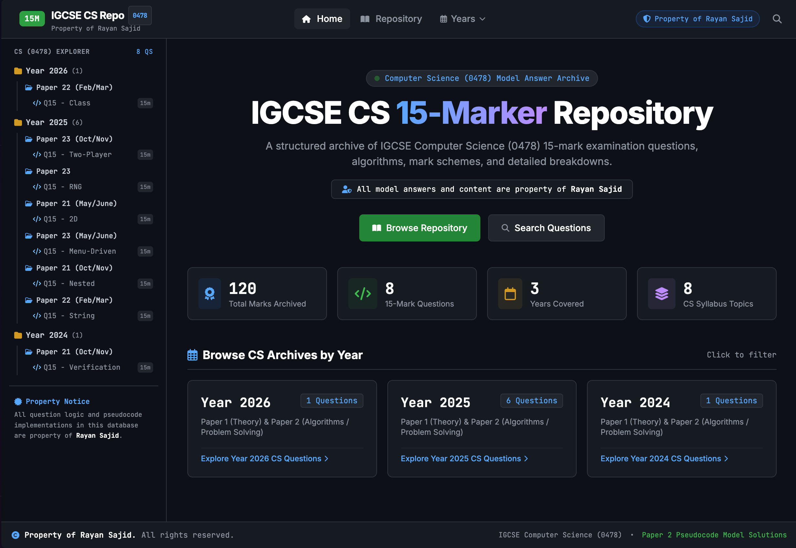
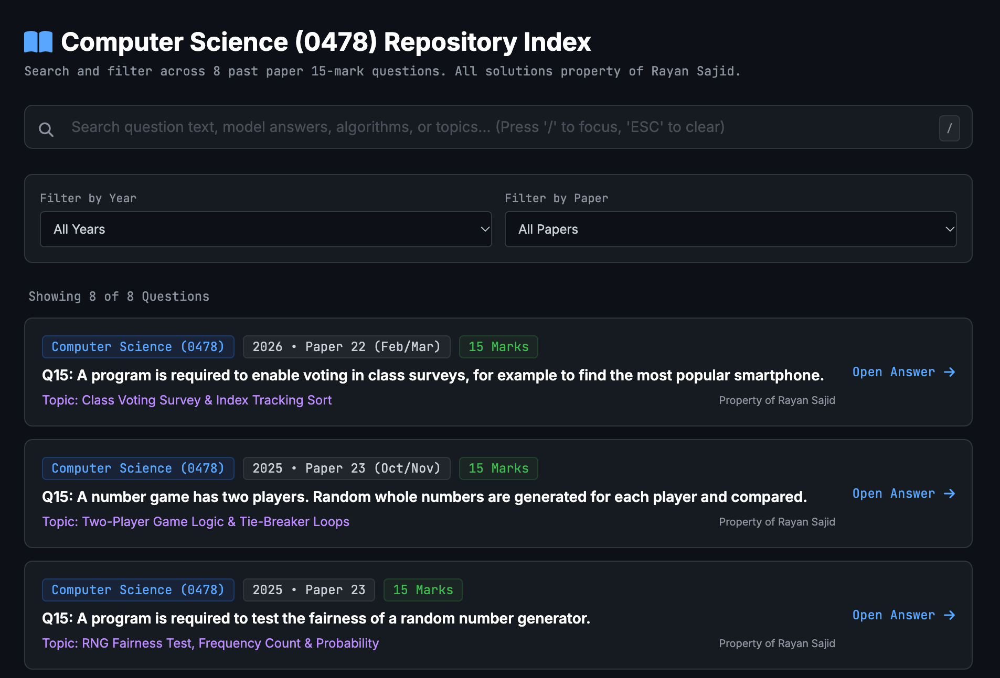
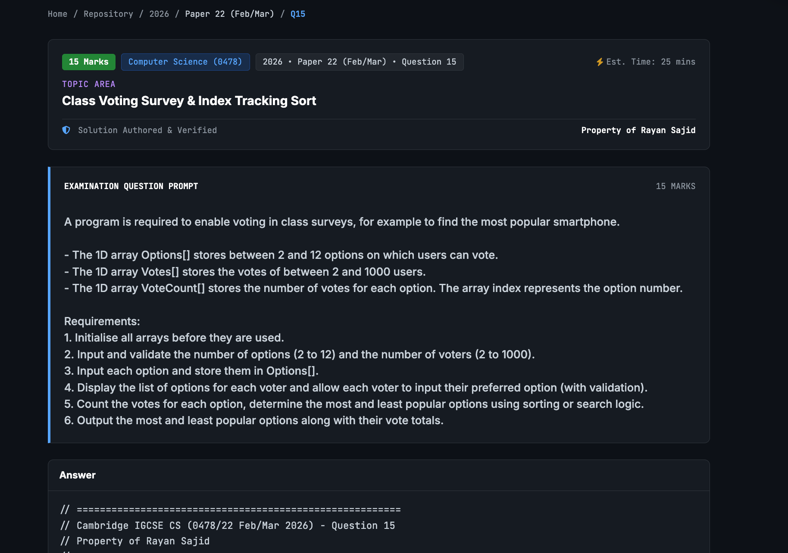
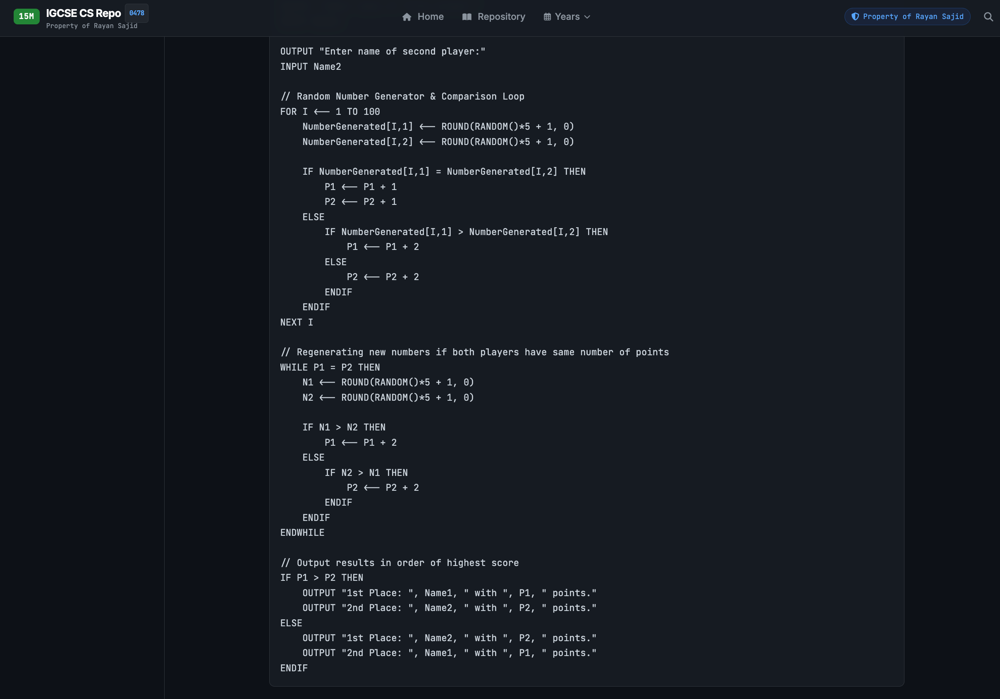

# IGCSE CS 15-Marker Repository

> A collection of Cambridge IGCSE Computer Science (0478) 15-mark questions, model solutions, marking criteria, and evaluation points.

**Built by Rayan Sajid**

---

## Preview

---

## Features

* 📚 **15-mark question archive** — Organised by year and paper
* 🔎 **Search** — Search questions, topics, years, and solutions
* 🎛️ **Filters** — Filter by examination year and paper
* 💻 **Model solutions** — Pseudocode solutions presented in a code-editor style
* 📋 **Marking criteria** — AO1, AO2 and AO3 breakdowns
* 🧠 **Evaluation points** — Key ideas and algorithmic decisions explained
* ⏱️ **Estimated time** — Designed around 15-mark exam practice
* 📱 **Responsive** — Works on desktop and mobile
* ⌨️ **Keyboard shortcuts** — `/` for search and `ESC` to clear

---

## Screenshots

### Repository

### Question

### Model Answer

---

## Tech Stack

* HTML5
* JavaScript
* Tailwind CSS
* Font Awesome
* Google Fonts
* Static / client-side application

---

## Access the website

Open `https://igcse-15-markers.vercel.app/`.

---

## Purpose

Finding every 15-mark question across multiple past papers can be annoying.

This project puts them into one place so you can:

**Find → Attempt → Compare → Analyse → Repeat**

---

## Author

**Rayan Sajid**

Cambridge IGCSE Computer Science (0478)

---

⭐ If you find it useful, consider starring the repository.
